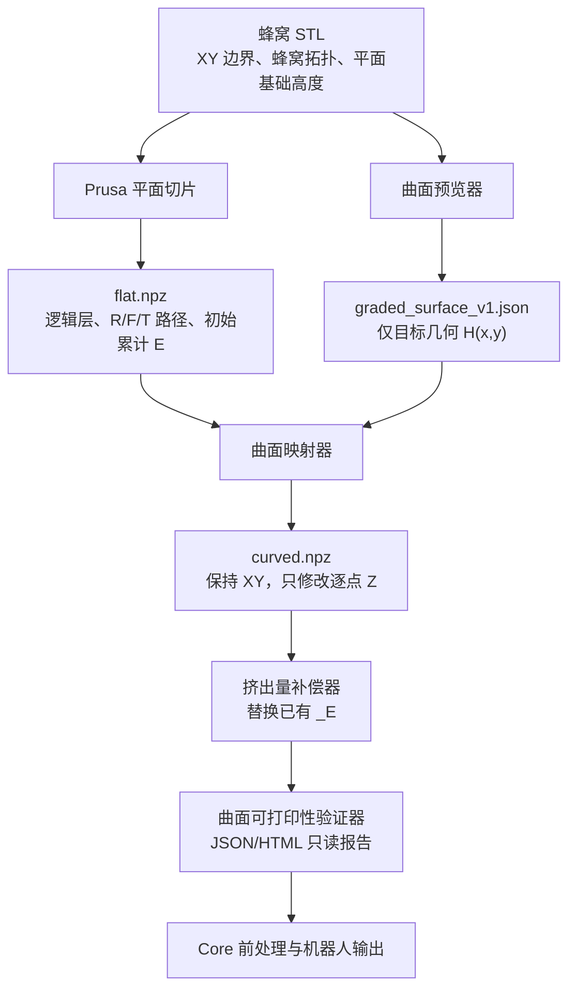

# 渐变曲率蜂窝曲面打印工作流（更新版）

## 1. 文档目的与当前结论

本项目的目标是把平面蜂窝结构逐层沉积为具有双正弦目标形貌的蜂窝实体，而**不是**在已成型的曲面上覆盖一层蜂窝，也不是把蜂窝在 XY 平面内拉伸、扭曲或重新排布。

最终结构采用对称的“平—曲—平”层间形貌：

```text
底部平面蜂窝
    → 逐层增加曲率
    → 中部达到完整目标曲率
    → 逐层回落
    → 顶部恢复平面蜂窝（孔洞保持开口）
```

当前已经完成：平面路径切片、目标曲面预览、曲面逐点 Z 映射、对称层间渐变、R/F
路径重采样、已有 E 数组的三维弧长补偿、曲面法向 KUKA ABC 生成、只读可打印性
验证器，以及曲面路径进入 Core 时保留逻辑层和逐点 Z 的接口回归。

当前生产蜂窝逻辑是提交 `08fc814` 引入的 `macro_partition_zero_e`：从真实 STL 截面
恢复蜂窝墙图，每条墙边只沉积一次；区内使用不穿孔、转角不超过 90° 的恒定 E
连接，区间使用显式 T 空走。随后提交 `cc23961` 增加的是规则蜂窝可视化原型和测试，
不是替代生产规划器。

## 2. 总体数据流与模块边界



模块职责必须保持分离：

| 模块 | 输入 | 输出 | 负责的事 | 不负责的事 |
| --- | --- | --- | --- | --- |
| `surface_preview` | STL 投影、曲面参数 | `graded_surface_v1.json` | 预览和定义目标曲面几何 | 切片、层间策略、修改路径、写入 E |
| Prusa 平面切片 | STL、平面工艺参数 | `flat.npz` | 蜂窝轮廓、填充、路径顺序、空走和初始 E | 曲面 Z、姿态、曲面工艺约束 |
| `surface_mapper` | `flat.npz`、曲面 JSON | 映射后的路径 | 按逻辑层对 R/F/T 逐点映射 Z | 重排路径、改变 XY、重新切片 |
| `extrusion_compensator` | 平面 NPZ、映射 NPZ | 带新 E 的 `curved.npz` | 按曲面弧长替换已有 E | 为缺失 E 的路径虚构 E、姿态或流量控制 |
| `surface_validator` | `flat.npz`、`curved.npz`、曲面 JSON | JSON/HTML 验证报告 | 判断几何、层间、E、空走风险是否可接受 | 修改路径或声称完成实体喷头碰撞证明 |
| Core | 通过验证的 `curved.npz` | 系统/机器人路径 | 三维路径的后续处理和机器人执行 | 用普通平面层高覆盖曲面 Z |

## 3. 输入文件的语义

### 3.1 蜂窝 STL

STL 是蜂窝结构的拓扑与平面基准，不是最终曲面高度的直接来源。

- 决定 XY 投影、蜂窝孔洞、外轮廓和材料区域；
- 决定平面切片的基础层数与基础 Z；
- 外轮廓应尽量沿完整六边形单元或闭合边界自然收边，避免把单元硬切成无法闭合的半单元；
- 顶部仍是开口蜂窝，不应为了“顶面平”生成连续实心封盖。

当前测试件为 `150 mm × 100 mm`、蜂窝边长 `5 mm`。10 mm 高版本以 0.5 mm 的树脂层高产生 20 个逻辑层。

### 3.2 平面路径 `flat.npz`

`flat.npz` 是曲面映射的唯一路径来源，应由 Prusa 平面切片获得。当前参考工艺基线为：

- 树脂线宽：`2.0 mm`；
- 树脂层高：`0.5 mm`；
- 纤维层高：`0.1 mm`；
- 蜂窝路径、轮廓、空走顺序和初始累计 E：由平面切片保留。

它使用 `external_layer_paths_v1`，核心数组为：

```text
layer_0000_R      树脂沉积 XYZ 路径
layer_0000_F      纤维沉积 XYZ 路径
layer_0000_T      非沉积空走 XYZ 路径
layer_0000_R_E    与 R 路径逐点对应的累计 E（可选）
layer_0000_F_E    与 F 路径逐点对应的累计 E（可选）
```

`layer_XXXX` 是**逻辑沉积层号**，不是由某个点的 Z 值反推出来的“高度层”。曲面映射后，同一逻辑层内的 Z 本来就会不同；之后所有模块都必须继续保留该层号。

### 3.3 目标曲面 `graded_surface_v1.json`

该 JSON 只定义目标几何，不携带层间工艺策略。当前支持：

\[
H(x,y)=A\sin\left(\frac{2\pi x}{\lambda_x}+\phi_x\right)
       \sin\left(\frac{2\pi y}{\lambda_y}+\phi_y\right)+Z_{ref}
\]

其中：

- `A`：幅值；
- `λx`、`λy`：X、Y 方向波长；
- `φx`、`φy`：相位；
- `Zref`：曲面整体基准偏移；
- STL 的 XY 投影与源文件哈希用于检查曲面 JSON 是否属于同一个模型。

曲面 JSON 不应包含“曲面起始层”“曲面完成层”“安全抬升”或 E；这些属于映射或后续工艺模块。

## 4. 曲面映射：平—曲—平的层语义

对平面路径中第 `k` 个逻辑层的任意点：

\[
z_{mapped,k}(x,y)=z_{flat,k}+\alpha_kH(x,y)
\]

映射器遵循以下不变量：

- XY 坐标保持原样；
- R/F/T 分组、逻辑层号、路径顺序、点顺序和 NaN 填充保持原样；
- 不重新生成蜂窝，也不按曲面后的 Z 重分层；
- 曲面后的任何路径点均不得低于 `Z = 0 mm`；否则拒绝导出。

用户只设置“曲面起始层”。设最后一个逻辑层为 `Lmax`，起始层为 `s`：

- `0 … s`：底部平面，`α=0`；
- 从 `s` 之后开始平滑增加曲率；
- 整个零件的中部层达到 `α=1`；层数为偶数时，中间两层共同达到完整曲率；
- 之后镜像回落；
- 从 `Lmax-s` 至顶部：恢复平面，`α=0`。

因此，目标曲面形貌位于零件中部，而顶部恢复平面并不意味着顶面被填成实心盖。

最终零件的真实高度不是只由 STL 的名义高度决定，而是由导出 `curved.npz` 的实际 `Z min / Z max` 决定。映射器预览和后续验证器都必须报告该范围。

## 5. E 重算与文件替换规则

曲面映射使某一沉积段的三维长度发生变化。对平面路径中正挤出段的原始增量：

\[
\Delta E_{curve}=\Delta E_{flat}
\frac{ds_{curve}}{ds_{flat}}
\]

其中 `ds_flat` 和 `ds_curve` 分别是同一相邻点段在平面、曲面后的三维长度；对于平面路径，`ds_flat` 通常等于 XY 段长。

当前实现的规则为：

1. 仅处理已存在的 `layer_XXXX_R_E` 和 `layer_XXXX_F_E`；
2. 每一条路径的第一个累计 E 保持原值；
3. 每个正 `ΔE` 按上述比例缩放，再重建累计 E；
4. 零或负 `ΔE`（例如回抽语义）保持原样；
5. `_E` 数组的键名、二维形状、路径/点索引及 NaN 填充必须与对应 XYZ 数组完全一致；
6. 若平面与曲面 NPZ 的 E 键、路径形状、XY 或填充不一致，拒绝补偿；
7. 没有 `_E` 的材料路径保持没有 `_E`，不创建猜测性的 E。

这只是第一阶段的**弧长补偿**。它尚未补偿局部层间间隙、条带横截面积、喷嘴姿态或速度变化导致的体积流量变化。

## 6. 已实现：曲面可打印性验证器

独立包 `kuka_slicer/surface_validator` 已实现为只读模块：输入为 `flat.npz`、
`curved.npz` 与曲面 JSON，输出为 JSON/HTML 验证报告，不修改路径。

### 6.1 必须具备的检查

#### 格式与映射完整性

- 所有路径点 Z 有限且 `Z >= 0`；
- 曲面 JSON 与源 STL 的身份、XY 域一致；
- XY、逻辑层、R/F/T、路径顺序和点顺序未被破坏；
- 曲面映射元数据和 E 补偿元数据完整；
- `_E` 与 XYZ 的路径数、点数、NaN 填充一致。

#### 层间几何

- 报告最终的真实 `Z min / Z max` 和实际最大高度；
- 检查相邻逻辑层在局部是否出现过大间隙、反向穿插或不连续跳变；
- 检查局部坡度、相邻点 `dz` 与曲率变化；
- 检查采样密度是否足以表达当前波长，避免曲面变为折线；
- 检查外轮廓闭合证据、蜂窝生产契约及 XY 拓扑稳定性。由于当前输入不包含 STL
  实体，验证器不能独立重建孔洞区域；这项限制会明确报告，而不是把它当作发现了
  封孔问题。

#### 工艺风险

- 统计 E 弧长倍率及异常峰值；
- 在没有速度输入时，只能评估“每毫米挤出变化”和 E 异常，不能声称已验证最大体积流量；
- 待速度、喷嘴与材料标定参数接入后，再检查最大体积流量；
- 对 `T` 空走路径做点级风险筛查。实体喷头扫掠碰撞将在三维预览接入 SolidWorks
  装配体转换出的喷头实体、姿态和已沉积几何后单独实现。

目前 `T` 路径随 Z 映射保持原有顺序。验证器的同 XY 顶点净空筛查不是喷头实体的
扫掠体证明；在实体碰撞模块完成前，有 T 路径的报告会保留人工确认提示。

### 6.2 验证器的判定

每一项给出 `pass`、`warning` 或 `fail`：

- `fail`：不得进入 Core；
- `warning`：允许导出报告，但需要人工确认或工艺试验；
- `pass`：可进入 Core 端到端验证。

## 7. 进入 Core 前的端到端验证

验证通过后，使用真实 `curved.npz` 运行现有 Core 前处理链。此阶段的目标不是改变 Core 算法，而是证明中间接口不会把曲面破坏掉。

必须确认：

1. Core 不会使用 UI 中的平面层高覆盖输入点的 Z；
2. Core 不会从曲面 Z 重新推断层号，仍使用 `layer_XXXX` 的逻辑语义；
3. 平滑与重采样在三维 XYZ 曲线上进行；
4. Core 正确读取显式 `_E`，不会用默认 `e_per_mm` 覆盖它；
5. R/F/T 分组、路径顺序和事件顺序保持一致；
6. 输出的系统 NPZ 或机器人路径仍保留曲面后的 Z 形貌。

固定回归样例为：

```text
C:\Users\caRRot\Desktop\print_test\曲面测试\蜂窝-150x100x10mm-08-11
├─ 01_模型\蜂窝-150x100x10mm-08-11-边长5mm-模型.stl
└─ 02_曲面参数与预览
   ├─ 蜂窝-150x100x10mm-08-11-相位45度-全边界曲面参数.json
   └─ honeycomb_minimum_no_u_turn_partitions_surface_preview.npz
```

三者的绑定依据不是文件名猜测，而是哈希和 NPZ 元数据：

- STL SHA-256：`4d8750a3f9759fcaced60b9d7ecf8c55cdeffa12dea57a47579ed4e3aebd66c9`；
- 曲面规范化 SHA-256：`6ced5675fe56194adb07c47db637f829aa4ae955a863a688ed393c510c1a2491`；
- X/Y 相位均为 `π/4`，因此不能使用同目录的零相位“双正弦曲面参数.json”；
- 20 个逻辑层，曲面起始层 3、返回层 16、峰值层 9/10；
- 最新生产结果为 693 条 STL 墙边、251 条最少不重走子轨迹、6 个宏观分区、
  每层 5 条区间 T 空走、重复沉积墙边数为 0；
- 映射后材料 Z 范围为 `0.5 … 10.0 mm`，最大采样段长为 `1.5 mm`。

`tests/test_honeycomb_surface_reference.py` 固化上述契约。数据不在默认位置时可通过
`KUKA_SLICER_HONEYCOMB_REFERENCE_ROOT` 指定同一数据集根目录；数据缺失时测试跳过，
不会误用其他 STL 或曲面 JSON。

## 8. 试打印顺序

在 Core 端到端验证通过后，按风险从低到高试验：

1. 小尺寸、低幅值、长波长、喷嘴竖直的树脂路径；
2. 检查首层附着、层间接触、蜂窝孔洞、外轮廓及曲面剖面；
3. 固定几何后，逐步增加幅值或缩短波长；
4. 对比平面件和曲面件的线宽、层间结合及实际高度；
5. 根据实测结果修正速度、E 倍率、有效线宽与允许坡度。

ABC 已由解析曲面法向生成并通过接口测试，但在 XYZ 曲面沉积和实体空走碰撞验证
稳定之前，不直接把姿态能力等同于已完成安全试打。

## 9. 喷头碰撞与后续高级阶段

### 9.1 已实现：峰值曲率层喷头实体碰撞预检

在离线端导入本地映射 NPZ 后，可点击“检查当前 NPZ 碰撞”。该命令不参与实时预览，也不修改 NPZ、切片或 Core 输入。其边界如下：

- 只读取 NPZ `surface_mapping.progression.peak_layers`（本基准为第 9、10 层），不以当前 TCP 点法向或旧锥度阈值判断；
- 使用 NPZ 记录的 SHA-256 在同一测试包内唯一解析曲面 JSON 和源 STL，拒绝名称相同但哈希不同的文件；
- 从源 STL 的对应平面截面恢复材料区域，因此蜂窝孔洞保持开口，不会被当作实体曲面；
- 候选四棱锥仅作 TCP 邻域粗筛；最终以 SolidWorks 导出的加热块原始三角面实体做闭合网格相交判定，预览不显示包围盒或候选域；
- 当前默认采用两阶段：先以 0.5 mm 覆盖全部峰值层路径；若通过，则围绕初筛最小净空 TCP 的 6 mm 邻域以 0.1 mm 复核。无额外安全间隙。工具栏固定显示最终最小采样净空（加热块 CAD 面采样点到其正下方曲面材料点的最小 Z 向距离）以及两阶段范围。出现相交立即报告首个峰值层和 TCP 姿态。

该预检覆盖的是最大曲率层的完整已映射路径，而非播放器当前点。它是面向当前双正弦蜂窝工况的低开销前置检查；包含软管、电缆、法兰、机械臂和全高度扫掠的系统级碰撞，仍属于后续独立范围。

### 9.2 暂不实现

以下内容应在上述流程稳定后单独立项：

- 考虑局部层间间隙、有效线宽、速度和材料截面积的体积流量模型；
- 基于 SolidWorks 喷头装配实体的扫掠碰撞、空走避障、安全高度和机器人运动学约束；
- 将曲面约束更深地整合进统一路径层或 Prusa 后端；
- 曲面沉积仿真与自动工艺窗口推荐。

## 10. 当前执行清单

```text
[完成] 蜂窝 STL 与 XY 投影
[完成] Prusa 平面切片为 flat.npz
[完成] 目标曲面预览与 graded_surface_v1.json
[完成] 对称 平—曲—平 的逻辑层 Z 映射
[完成] 非负 Z 拒绝
[完成] R/F 曲面重采样与曲面法向 KUKA ABC
[完成] 已有 _E 的三维弧长补偿
[完成] surface_validator：几何、层间、E、空走风险报告
[完成] curved.npz → Core 的逻辑层、逐点 Z、显式 E 接口回归
[完成] 最新最少分区恒定 E 蜂窝逻辑接入生产 slicer
[完成] 150×100×10 mm 相位 45° 基准文件绑定与回归契约
[完成] SolidWorks 喷头装配实体预览；峰值曲率层加热块实体碰撞预检
[随后] 低风险 XYZ/ABC 试打印与工艺标定
[最后] 体积模型、自动避障与工艺窗口推荐
```
