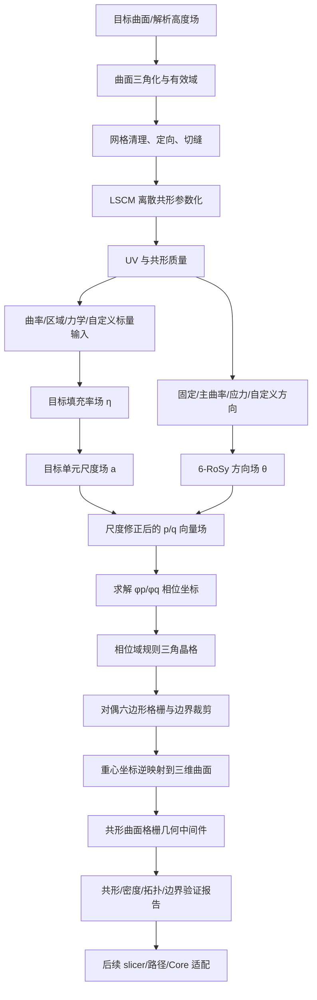

# 蜂窝网格曲面共形映射流程

> 文档性质：方法设计、代码复用分析与后续 Agent 修改指导书  
> 当前状态：设计基线，不代表代码已经实现  
> 当前任务边界：仅形成流程与修改指导；不得据此声称现有 slicer 已实现离散共形参数化或变密度曲面格栅  
> 适用仓库：`kuka_slicer`  
> 建议后续方法名称：**基于离散共形参数化与可定制设计场调控的曲面变密度六边形格栅结构生成方法**

---

## 0. 文档用途与一条核心结论

本文档用于把当前讨论形成一套可执行、可验证、可分阶段交付的技术方法，并明确：

1. 目标方法究竟解决什么问题；
2. “曲面共形”“蜂窝格栅”“填充率”“方向场”等术语分别指什么；
3. 如何从目标曲面生成可变密度、可变方向且可自定义参数的六边形格栅；
4. 哪些现有代码可以复用，哪些代码必须修改或重写；
5. 后续 Agent 应按什么顺序实现、测试和交付；
6. 哪些结果可以作为论文证据，哪些结论目前不能声称。

本文档的核心结论是：

> 新方法应把“曲面到二维参数域的近似保角映射”“二维参数域中的格栅设计场”“格栅到三维曲面的逆映射”分为三个相互独立但通过显式数据契约连接的模块。现有 `z_mapped = z_flat + alpha * H(x,y)` 只能作为旧版高度场基线，不能继续作为新共形方法的核心。

现阶段不讨论具体打印填充、连续路径、空走、E、Core 平滑或机器人执行。上述内容属于结构几何生成之后的下游阶段。本方法必须先生成一份独立、可验证的三维曲面蜂窝结构几何，再考虑如何切片和执行。

---

## 1. 术语表与符号锁定

后续代码、配置、论文和界面必须统一使用本节术语，避免同一变量承担多个含义。

| 名称 | 符号/建议字段 | 定义 |
| --- | --- | --- |
| 目标曲面 | \(\mathcal M=(V,F)\) | 经过清理、定向和必要切缝后的三角网格曲面 |
| 参数域 | \(\Omega\subset\mathbb R^2\) | 目标曲面展开后的二维 UV 区域 |
| 正向参数化 | \(f:\mathcal M\rightarrow\Omega\) | 从三维曲面到二维 UV 的离散共形参数化 |
| 逆参数化 | \(g=f^{-1}:\Omega\rightarrow\mathcal M\) | 通过三角面对应关系和重心坐标把 UV 点映射回三维曲面 |
| 共形畸变 | \(K_c=\sigma_1/\sigma_2\) | 单个三角面映射雅可比两个奇异值的比值；理想值为 1 |
| 目标填充率 | \(\eta(p)\) / `target_fill_ratio` | 曲面局部区域中格栅实体面积占局部曲面区域面积的比例 |
| 填充率驱动场 | \(\rho(p)\) / `density_driver` | 归一化到 `[0,1]` 的几何、区域、力学或用户自定义标量场；它不是填充率本身 |
| 墙宽 | \(w\) / `wall_width_mm` | 格栅墙体设计宽度；第一阶段固定，不与填充率同时变化 |
| 目标单元尺度 | \(a(p)\) / `cell_size_mm` | 曲面上的目标六边形边长或等效节距 |
| 共形尺度因子 | \(s(p)\) / `conformal_scale` | UV 微元到曲面微元的局部长度缩放 |
| 方向场 | \(\theta(p)\) / `orientation_field` | 六边形格栅的局部参考方向，按 60° 周期等价 |
| 六重旋转对称场 | `rosy6` | 用 \(z_6=e^{i6\theta}\) 表示的方向场，避免 60° 等价方向发生数值跳变 |
| 层间形貌系数 | \(\alpha_k\) / `layer_shape_alpha` | 现有平—曲—平逻辑层进度；不得再用 `alpha` 表示填充率 |
| 相位坐标场 | \(\phi^p,\phi^q\) | 将尺寸场和方向场积分为二维格栅坐标的两个标量场 |
| 格栅缺陷 | `lattice_defect` | 非六邻接内部单元、奇点、接缝终止或边界裁剪单元 |

### 1.1 “共形”的声明边界

本文方法把“共形”分为两层：

1. **数学层面的离散近似共形参数化**：`LSCM` 等算法使局部角度畸变最小，以 \(K_c\)、角度误差和翻转三角形数量作为证据；
2. **工程层面的曲面共形结构**：格栅中性几何位于目标曲面上，结构厚度或层间偏置沿局部法向定义，且连接拓扑可追踪。

不能把以下性质自动写入结论：

- 共形不等于等距，不能保证三维边长不变；
- 共形不等于等面积，不能保证单元面积不变；
- 共形不等于无缺陷，任意自由曲面和任意密度梯度下不能保证全局都是规则六边形；
- 变密度格栅不等于结构优化，除非密度场由明确的载荷、边界条件和优化目标产生并经过力学验证。

---

## 2. 问题定义

### 2.1 输入

新结构生成模块应接收以下输入：

1. 目标承载曲面：解析高度场或三角网格；
2. 曲面有效域：外边界、可选禁用区和必要切缝；
3. 格栅基础参数：墙宽、基准单元尺度或基准填充率、边界处理方式；
4. 填充率驱动场：常量、曲率、用户区域、外部力学场或它们的组合；
5. 方向场：固定方向、主曲率方向、用户方向或外部主应力方向；
6. 制造约束：最小墙间距、最小/最大单元尺度、最大尺寸梯度、允许缺陷策略；
7. 可复现性参数：求解器容差、随机种子、网格分辨率、锚点和切缝策略。

### 2.2 输出

方法的直接输出不是打印路径，而是结构几何中间件：

1. 目标曲面的三角网格与 UV 坐标；
2. 每个三角面的共形畸变指标；
3. 每个顶点或三角面的目标填充率、目标单元尺度和方向场；
4. 相位坐标 \(\phi^p,\phi^q\) 及其可积性残差；
5. 二维格栅节点、边、单元和边界裁剪关系；
6. 每个格栅节点对应的源曲面三角形编号与重心坐标；
7. 逆映射后的三维节点、边和单元；
8. 共形、密度、方向、拓扑和边界质量报告；
9. 完整配置、输入哈希和求解器版本。

### 2.3 初始支持范围

第一版应明确限制为：

- 单个连通、可定向、具有边界的曲面片；
- 参数域可通过一个切缝展开为单连通区域；
- 目标曲面无自交；
- 首个生产基准继续使用当前双正弦高度场；
- 墙宽固定，填充率首先通过局部单元尺度变化实现；
- 允许边界附近出现被裁剪的非完整六边形；
- 内部格栅缺陷必须显式记录，不得静默删除或伪装为六边形。

闭合曲面、多连通曲面、分支曲面、拓扑自动切缝和全局缺陷优化属于后续扩展。

---

## 3. 当前 slicer 的实际方法与新方法差异

### 3.1 当前方法

当前 `surface_mapper` 对任意路径点执行：

\[
(x,y,z)\mapsto\left(x,y,z+\alpha_k H(x,y)\right)
\]

其主要性质是：

- XY 保持不变；
- 只支持 `double_sine_product` 解析高度场；
- 曲面形貌由逻辑层系数 \(\alpha_k\) 控制；
- R/F 路径映射前按平面 XY 段长重采样；
- T 路径不重采样，但也会被重新计算 Z 和 ABC；
- KUKA ABC 来自解析高度场梯度；
- E 补偿假定映射前后路径点一一对应且 XY 完全相同；
- 验证器同样把“XY 不变”作为硬约束。

该方法是**基于显式高度场的 Z 向形貌调制**，不是离散共形参数化。

### 3.2 新方法

新方法的结构主链应改为：

```text
目标曲面三角网格
    → 曲面清理与切缝
    → 离散共形 UV 参数化
    → 共形尺度与曲率计算
    → 填充率/单元尺度/方向设计场
    → 相位坐标场求解
    → 二维变尺度六边形格栅生成
    → 三角面重心坐标逆映射
    → 三维曲面格栅几何
    → 几何与设计场验证
    → 后续路径/打印适配（不属于当前文档实现任务）
```

新方法允许 XY 改变，也允许格栅拓扑相对旧平面蜂窝发生受控变化。因此，当前所有依赖“XY 不变”和“点数完全一致”的验证与补偿逻辑都不能直接套用。

---

## 4. 总体架构与模块边界



模块边界必须遵循：

- 曲面参数化只负责曲面与 UV 的双向对应，不负责填充率；
- 填充率模块只产生目标标量场，不直接修改曲面；
- 方向场模块只产生 60° 周期方向，不直接生成路径；
- 格栅生成模块使用尺度场和方向场构造结构拓扑；
- 逆映射模块只根据三角形对应和重心坐标恢复三维几何；
- 验证器只读，不自动修复失败结果；
- 路径规划必须在结构几何通过验收后单独进行。

---

## 5. 模块 A：目标曲面与三角网格准备

### 5.1 目标曲面表示

统一把目标曲面表示为：

\[
\mathcal M=(V,F),\qquad V\in\mathbb R^{n\times3},\quad F\in\mathbb N^{m\times3}
\]

当前双正弦高度场可继续作为首个曲面提供器：

\[
H(x,y)=A\sin\left(\frac{2\pi x}{\lambda_x}+\varphi_x\right)
       \sin\left(\frac{2\pi y}{\lambda_y}+\varphi_y\right)+Z_{ref}
\]

但必须先在独立的承载域上采样并三角化为 \(\mathcal M\)，之后的共形算法不再直接依赖 `DoubleSineSurface`。

### 5.2 承载曲面域与蜂窝实体域分离

新方法必须区分：

- **承载曲面域**：格栅要附着的连续曲面片；
- **蜂窝材料域**：由新算法生成的墙体和孔洞；
- **外边界/禁用区**：格栅允许存在的范围。

当前蜂窝 STL 中的孔洞不能继续作为目标曲面的参数化孔洞，否则会把待生成的蜂窝拓扑提前写死进参数域。首版应使用外轮廓定义承载曲面域，蜂窝孔洞由格栅生成模块重新产生。

### 5.3 网格预处理

参数化前必须完成：

1. 合并容差内重复顶点；
2. 删除零面积和近零面积三角形；
3. 统一三角面朝向；
4. 检查非流形边和非流形顶点；
5. 检查自交与重复面；
6. 提取连通分量和边界环；
7. 对闭合或多连通曲面生成显式切缝；
8. 记录所有修改前后的顶点映射和输入哈希。

硬失败条件：

- 无法定向；
- 存在未处理的非流形结构；
- 存在自交且没有明确修复策略；
- 切缝后仍不是目标支持范围内的单连通曲面片。

---

## 6. 模块 B：离散共形参数化

### 6.1 推荐首选：LSCM

首版使用 Least Squares Conformal Maps（LSCM）建立：

\[
f:\mathcal M\rightarrow\Omega,\qquad v_i\mapsto (u_i,v_i)
\]

选择 LSCM 的原因：

- 直接面向三角网格；
- 以局部保角为目标；
- 可形成稀疏线性最小二乘系统；
- 容易对每个三角面计算可重复的畸变指标；
- 比直接实现截图中的完整向量场积分更适合先建立严格的共形基线。

### 6.2 锚点与边界

LSCM 至少需要固定两个非重合参数点消除刚体自由度。推荐规则：

1. 优先使用用户指定的边界特征点；
2. 无用户锚点时，在最长边界环上选择测地距离尽可能远的两个顶点；
3. 将锚点编号、三维坐标、UV 坐标和选择规则写入元数据；
4. 不得依赖顶点遍历顺序随机选择锚点。

### 6.3 共形质量

对每个三角面计算从 UV 到三维切平面的雅可比 \(J_t\)，并求奇异值：

\[
\sigma_1\ge\sigma_2>0
\]

共形畸变定义为：

\[
K_c(t)=\frac{\sigma_1}{\sigma_2}
\]

同时记录：

- 面积尺度：\(s_A=\sigma_1\sigma_2\)；
- 代表长度尺度：\(s_L=\sqrt{\sigma_1\sigma_2}\)；
- 三角形三个角的最大绝对误差；
- UV 有向面积符号；
- 翻转三角形数量；
- 非相邻 UV 三角形的全局重叠数量；
- 面积加权的平均值、P95、P99 和最大共形畸变。

必须满足：

- UV 翻转三角形数量为 0；
- UV 三角形不得退化；
- 参数域内不得存在非接触邻接关系导致的全局三角形重叠；
- 映射和逆映射在数值容差内闭合；
- 超过质量阈值时输出失败或警告，不能只输出一张“看起来正常”的 UV 图。

### 6.4 关于任意密度场与严格共形性的兼容性

任意指定的局部尺度场通常不能同时满足全局严格共形、完全可积和无缺陷规则六边形。特别是任意给定的 `density_driver` 不一定对应某个全局共形映射允许的尺度函数。

因此本方法必须分开声明：

- `LSCM` 负责曲面到 UV 的近似共形；
- 后续尺寸/方向场负责在 UV 中放置格栅；
- 若尺寸/方向场不可积，允许以最小二乘方式逼近，但必须报告积分残差和格栅缺陷；
- 不能因为格栅在 UV 中被二次变形，就把二次变形也称为严格共形映射。

---

## 7. 模块 C：填充率、单元尺度与可自定义标量场

### 7.1 填充率的物理定义

对曲面局部邻域 \(P\subset\mathcal M\)，定义：

\[
\eta(P)=\frac{A_{\mathcal M}(W\cap P)}{A_{\mathcal M}(P)}
\]

其中 \(W\) 是格栅墙体覆盖区域，\(A_{\mathcal M}\) 是曲面面积。

对于墙宽 \(w\) 远小于正六边形边长 \(a\) 的薄壁近似：

\[
\eta\approx\frac{2w}{\sqrt3a},\qquad
a\approx\frac{2w}{\sqrt3\eta}
\]

该公式只能用作初值。当前项目典型参数 `w=2 mm`、`a=5 mm` 并不满足很强的薄壁假设，因此最终填充率必须通过实际墙体缓冲几何和曲面面积积分重新计算，不能把近似公式当作最终结果。

### 7.2 第一阶段只改变单元尺度

首版固定：

- 墙宽 `wall_width_mm`；
- 结构厚度/层间定义；
- 材料类型。

只通过改变局部单元尺度 \(a(p)\) 调节填充率。原因是如果墙宽、单元尺度、层高和材料流量同时变化，将无法判断填充率变化来自哪个因素，也无法形成清晰的消融实验。

### 7.3 填充率驱动场来源

统一定义归一化驱动场：

\[
\rho_j(p)\in[0,1]
\]

应支持以下来源：

| 模式 | 建议字段 | 含义 | 证据边界 |
| --- | --- | --- | --- |
| 常量 | `constant` | 全曲面相同填充率 | 均匀基线 |
| 曲率 | `curvature` | 由平均曲率、绝对高斯曲率或主曲率构造 | 几何自适应，不等于力学最优 |
| 用户区域 | `roi` | 点、曲线、多边形或涂抹权重通过曲面测地距离扩散 | 设计者指定功能区 |
| 外部标量场 | `external_scalar` | 每顶点/每面自定义数值 | 必须记录来源、单位与哈希 |
| 力学场 | `stress` / `strain_energy` | FEA 主应力、等效应力或应变能 | 需要明确载荷、约束和材料模型 |
| 组合 | `weighted_composite` | 多个驱动场按权重组合 | 必须保留每个分量和权重 |

不能直接规定“峰、谷一定加密”。峰谷或高曲率区域是否需要提高填充率取决于研究目标。若目的是承载，应以应力、应变能或失效风险作为主要证据；曲率场适合先做几何驱动演示和对照实验。

### 7.4 多场组合

建议用有界逻辑函数组合多个驱动场：

\[
r(p)=b_0+\sum_j\beta_j\rho_j(p)
\]

\[
\eta^*(p)=\eta_{min}+
(\eta_{max}-\eta_{min})\frac{1}{1+e^{-r(p)}}
\]

其中：

- \(b_0\) 控制基准填充率；
- \(\beta_j\) 控制第 \(j\) 个场的影响强度和正负方向；
- \(\eta_{min},\eta_{max}\) 来自制造约束而非图形显示范围。

若用户直接提供 `target_fill_ratio`，则跳过上述组合，并把用户场作为 \(\eta^*\) 使用。

### 7.5 平滑与梯度限制

原始目标场不能直接用于格栅生成。推荐在曲面上求解筛选泊松平滑：

\[
(M+\tau L)\eta=M\eta^*
\]

其中 \(M\) 是质量矩阵，\(L\) 是曲面 Laplace-Beltrami 离散算子，\(\tau\) 控制平滑尺度。

平滑后必须：

1. 投影回 `[eta_min, eta_max]`；
2. 根据制造允许值转换为 \(a(p)\)；
3. 限制相邻区域的相对尺寸变化；
4. 报告平滑前后差异；
5. 保留用户锁定区域，避免平滑覆盖硬约束。

建议把最大梯度写成无量纲约束：

\[
\left\|\nabla_{\mathcal M}\log a\right\|\le g_{max}
\]

具体数值必须通过打印尺寸和试验标定确定，不能在没有依据时写死为“安全值”。

### 7.6 UV 尺度补偿

若 UV 到曲面的局部长度尺度为 \(s_L(p)\)，为了在曲面上获得目标物理单元尺度 \(a_{phys}(p)\)，UV 中使用：

\[
a_{uv}(p)=\frac{a_{phys}(p)}{s_L(p)}
\]

若忽略该项，即使 UV 中格栅完全均匀，曲面上的实际单元大小也会随着参数化尺度变化。

---

## 8. 模块 D：六重旋转对称方向场

### 8.1 为什么不是普通二维角度

规则六边形绕 60° 旋转后等价，因此方向应使用：

\[
z_6(p)=e^{i6\theta(p)}
\]

而不是直接平滑 \(\theta\)。直接对角度做算术平均会在 0°/60° 边界产生错误跳变。

### 8.2 方向来源

建议支持：

- `global_axis`：把全局 X/Y 或用户向量投影到曲面切平面；
- `principal_curvature`：沿最大或最小主曲率方向；
- `principal_stress`：沿外部力学场主方向；
- `user_polyline`：沿用户绘制的曲面曲线传播方向；
- `external_rosy6`：直接导入每顶点/每面六重对称复数场。

首版默认使用 `global_axis`，主曲率模式作为第二个内置模式。力学模式必须等外部场契约明确后接入。

### 8.3 平滑与奇点

在相邻三角面之间平滑 `rosy6` 时应考虑切平面平行移动，不能直接比较两个三维向量。应记录：

- 用户约束面和约束权重；
- 平滑能量；
- 方向奇点位置和指数；
- 与目标方向的偏差；
- 接缝两侧一致性。

方向奇点会引起格栅缺陷。该缺陷是几何和拓扑约束的结果，不应被静默删除。

---

## 9. 模块 E：p/q 向量场与相位坐标

### 9.1 与原方案截图的对应关系

截图中的 `p/q 向量场 → φp/φq 标量场 → 二维均匀格栅` 可以保留，但必须明确：

- `p/q` 是参数域中的目标坐标梯度，不是三维路径；
- 它们的模长表示每单位 UV 长度跨越多少个格栅周期；
- 填充率增大应导致目标单元尺度减小，因此梯度模长增大；
- `p/q` 的不可积部分通过最小二乘逼近，并输出残差；
- 两个正交坐标场本身生成的是二维坐标系，六边形由该坐标系中的 60° 三角晶格及其对偶产生。

### 9.2 p/q 定义

在 UV 参数域中定义参考方向：

\[
\mathbf d_p=(\cos\theta,\sin\theta),\qquad
\mathbf d_q=(-\sin\theta,\cos\theta)
\]

令局部 UV 单元尺度为 \(a_{uv}\)，则：

\[
\mathbf p=\frac{1}{a_{uv}}\mathbf d_p,qquad
\mathbf q=\frac{1}{a_{uv}}\mathbf d_q
\]

这一定义消除了 `exp(lambda*rho)` 正负含义不清的问题。若论文仍需要指数控制，可写成：

\[
a_{phys}=a_0e^{-\beta\rho}
\]

于是：

\[
\|\mathbf p\|=\|\mathbf q\|=
\frac{s_L}{a_0}e^{\beta\rho}
\]

其中 \(\beta>0\) 时，\(\rho\) 增大明确表示格栅加密。

### 9.3 标量场求解

在三角网格参数域中求解：

\[
\min_{\phi^p,\phi^q}
\sum_t A_t
\left(
\|\nabla\phi^p_t-\mathbf p_t\|^2+
\|\nabla\phi^q_t-\mathbf q_t\|^2
\right)
\]

需要固定相位原点和旋转自由度，并允许用户指定格栅相位锚点。输出至少包括：

- `phi_p`、`phi_q` 每顶点值；
- 每面梯度；
- 每面积积分残差；
- 最大残差；
- 相位映射的雅可比行列式；
- 翻转或退化相位三角形数量。
- 非相邻相位三角形的全局重叠数量。

若相位映射存在翻转或全局重叠，不得继续逆映射；应提示用户降低密度梯度、增加平滑或修改方向约束。局部正 Jacobian 只能证明局部定向正确，不能替代全局单射检查。

---

## 10. 模块 F：二维六边形格栅生成

### 10.1 基础晶格

在相位平面 \((\phi^p,\phi^q)\) 中建立单位三角晶格：

\[
\mathbf b_1=(1,0),\qquad
\mathbf b_2=\left(\frac12,\frac{\sqrt3}{2}\right)
\]

三角晶格点为：

\[
\mathbf c_{ij}=i\mathbf b_1+j\mathbf b_2+\mathbf c_0
\]

其中 \(\mathbf c_0\) 是可自定义相位偏移。三角晶格的 Voronoi 对偶形成六边形单元。

这一描述比“两个标量场直接生成六边形”更严谨：`φp/φq` 提供二维坐标，60° 晶格基负责六边形拓扑。

### 10.2 相位域到 UV 的逆定位

对每个相位晶格点：

1. 定位它落入的相位三角形；
2. 计算该点相对于相位三角形的重心坐标；
3. 用相同重心坐标插值得到 UV 点；
4. 记录源三角形编号和重心坐标；
5. 丢弃参数域外点；
6. 对接缝重复点执行显式配对，不用坐标近似猜测。

### 10.3 边界策略

必须提供明确模式：

- `clip`：格栅单元裁剪到边界，允许边界非六边形；
- `inset`：边界内缩后只保留完整单元；
- `snap`：边界附近节点吸附到边界，但必须限制位移和角度畸变；
- `boundary_frame`：生成独立外框，内部格栅与外框连接策略另行定义。

首版建议实现 `clip` 和 `inset`，暂不实现自动 `snap`。吸附容易造成小边、反转单元和不可控填充率。

### 10.4 内部缺陷

必须统计：

- 内部六邻接单元比例；
- 五邻接、七邻接及其他价数单元数量；
- 缺陷位置与方向场奇点的对应关系；
- 密度梯度区和接缝区缺陷数量；
- 边界裁剪单元数量。

不得把所有非六边形单元简单删除，因为删除会引入孔洞或改变局部填充率。

### 10.5 备用基线

可以额外实现“变半径 Poisson 采样 + 加权 Lloyd/CVT + Voronoi 对偶”作为对照基线。它更容易形成变密度近六边形，但不直接使用 `p/q → φp/φq` 的坐标场逻辑。

该基线可以用于判断：复杂相位场求解是否真正改善了方向一致性、密度误差和缺陷率。不得在相位场失败时静默切换到 CVT 并仍声称使用了同一方法。

---

## 11. 模块 G：逆映射到三维曲面

### 11.1 重心坐标逆映射

若 UV 点 \(x_{uv}\) 位于 UV 三角形 \((u_i,u_j,u_k)\) 中，其重心坐标为：

\[
(\lambda_i,\lambda_j,\lambda_k),\qquad
\lambda_i+\lambda_j+\lambda_k=1
\]

则三维点为：

\[
x_{3D}=\lambda_iv_i+\lambda_jv_j+\lambda_kv_k
\]

必须保存：

- `source_triangle_id`；
- `barycentric_weights`；
- `uv_position`；
- `xyz_position`；
- `mapping_residual`。

这比“加权平均返回三维曲面”更准确，因为权重来自明确的对应三角形，而不是任意邻域点。

### 11.2 曲线与单元边映射

格栅边不能只映射两个端点后用一条三维直线连接。若边跨越多个 UV 三角形，必须：

1. 在 UV 中求边与三角网格边的交点；
2. 按穿越顺序分段；
3. 把每个分段端点分别重心映射到对应三角面；
4. 必要时按曲面弦差继续细分；
5. 保留原格栅边 ID 与分段 ID。

否则三维线段可能离开目标曲面或穿入曲面内部。

### 11.3 法向厚度

若要从曲面中性线生成有厚度结构，推荐：

\[
x^{\pm}=x_{3D}\pm\frac{t}{2}n(x_{3D})
\]

其中 \(t\) 是结构厚度、\(n\) 是局部曲面法向。需要检查：

- 法向一致性；
- 偏置面自交；
- 局部曲率半径与偏置厚度关系；
- 接缝处法向连续性；
- 边界封口策略。

本文档不要求当前阶段直接生成可打印实体，但数据契约应预留 `normal_offset` 和厚度信息。

---

## 12. 多逻辑层与当前“平—曲—平”策略

### 12.1 推荐研究主模式

若题目强调“曲面共形格栅结构”，最清楚的主模式是：

1. 生成一个通过离散共形参数化得到的目标曲面格栅中性层；
2. 其他结构层沿目标曲面的局部法向偏置；
3. 所有层共享同一个格栅拓扑和曲面三角形对应关系。

建议模式名：`target_surface_normal_stack`。

### 12.2 当前兼容模式

当前 `LayerProgression` 的对称平—曲—平 \(\alpha_k\) 可以保留为兼容模式，但必须限定声明：

- \(\alpha=1\) 的峰值层对应完整目标曲面；
- \(0<\alpha<1\) 的中间层是形貌过渡层；
- 如果仅线性插值三维坐标，不能自动声称每个中间层都严格共形；
- 若要主张每一层都近似共形，应对每个 \(\alpha_k\) 曲面分别参数化，并以统一相位拓扑建立层间节点对应。

建议兼容模式名：`symmetric_shape_morphing`，不要继续把它与严格共形参数化混为一个概念。

---

## 13. 参数体系与配置建议

### 13.1 参数分层

所有参数分为四类：

| 类别 | 例子 | 是否允许用户修改 | 说明 |
| --- | --- | --- | --- |
| 设计目标 | 填充率、方向、墙宽、边界策略 | 是 | 用户真正想设计的结构性质 |
| 驱动参数 | 曲率权重、ROI、应力场权重 | 是 | 决定设计目标在何处分布 |
| 数值求解 | 网格分辨率、平滑强度、容差、迭代次数 | 高级模式 | 默认隐藏，但必须写入输出 |
| 验收阈值 | 翻转数、共形畸变、密度误差 | 可配置但不能关闭硬失败 | 用于判断结果是否可进入下一阶段 |

### 13.2 建议参数表

| 字段 | 类型 | 语义 | 初始策略 |
| --- | --- | --- | --- |
| `surface_provider` | enum | `double_sine` / `triangle_mesh` | 先支持当前双正弦三角化 |
| `parameterization_method` | enum | `lscm` | 第一版固定 LSCM |
| `anchor_strategy` | enum | 用户锚点/最远边界点 | 默认确定性最远边界点 |
| `seam_strategy` | enum | `none` / `user` / `auto_cut_graph` | 第一版单连通域可为 `none` |
| `wall_width_mm` | float | 墙宽 | 从当前工艺预设读取，但不由填充率模块修改 |
| `base_cell_size_mm` | float | 基准物理单元尺度 | 可用当前 5 mm 基准 |
| `target_fill_ratio` | field | 直接目标填充率 | 与 `density_driver` 二选一 |
| `density_driver.mode` | enum | constant/curvature/roi/external/stress/composite | 默认 constant |
| `density_driver.weights` | dict | 多场权重 \(\beta_j\) | 显式保存 |
| `fill_ratio_min/max` | float | 制造允许范围 | 由实际墙体几何和工艺标定产生 |
| `field_smoothing_mm` | float | 曲面平滑长度尺度 | 与曲面物理尺寸相关，不用网格层数表达 |
| `max_log_size_gradient` | float | 最大单元尺度梯度 | 由后续试验标定 |
| `orientation.mode` | enum | global/principal_curvature/user/stress/external | 默认 global |
| `orientation_angle_deg` | float | 全局初始方向 | 60° 周期规范化 |
| `orientation_smoothing` | float | 6-RoSy 平滑权重 | 输出实际能量 |
| `phase_origin` | vec2 | 格栅相位偏移 | 用户可调，默认确定性 |
| `boundary_mode` | enum | clip/inset/boundary_frame | 第一版 clip/inset |
| `random_seed` | int | 随机过程可复现 | 所有随机算法必须固定 |
| `layer_embedding.mode` | enum | normal_stack/symmetric_shape_morphing | 研究主模式 normal_stack |
| `quality_limits` | object | 共形、密度、拓扑阈值 | 与结果一起保存 |

### 13.3 变量命名限制

现有 `alpha_by_layer` 已表示层间形貌完成度。填充率不应继续使用截图中的 `alpha`，建议：

- 填充率：\(\eta\)；
- 归一化驱动场：\(\rho\)；
- 驱动强度：\(\beta\)；
- 层间形貌：\(\alpha_k\)；
- 共形长度尺度：\(s_L\)。

---

## 14. 建议数据契约

### 14.1 输入规范：`conformal_lattice_spec_v1.json`

建议结构：

```json
{
  "format": "conformal_lattice_spec_v1",
  "units": "mm",
  "source_surface": {
    "provider": "double_sine",
    "source_file": "...",
    "sha256": "...",
    "domain": "outer_boundary_only"
  },
  "parameterization": {
    "method": "lscm",
    "anchor_strategy": "farthest_boundary_pair",
    "seam_strategy": "none"
  },
  "lattice": {
    "family": "triangular_dual_hex",
    "wall_width_mm": 2.0,
    "base_cell_size_mm": 5.0,
    "boundary_mode": "clip",
    "phase_origin": [0.0, 0.0]
  },
  "fill_field": {
    "mode": "weighted_composite",
    "minimum": null,
    "maximum": null,
    "smoothing_length_mm": null,
    "drivers": []
  },
  "orientation_field": {
    "mode": "global_axis",
    "angle_deg": 0.0,
    "constraints": []
  },
  "layer_embedding": {
    "mode": "target_surface_normal_stack"
  },
  "quality_limits": {},
  "random_seed": 0
}
```

示例中的 `null` 表示必须由工艺标定或用户配置确定，不代表程序可以跳过检查。

### 14.2 输出规范：`conformal_lattice_geometry_v1.npz`

建议数组：

```text
surface_vertices_xyz
surface_faces
surface_uv
surface_vertex_normals
conformal_ratio_per_face
angle_error_deg_per_face
area_scale_per_face
target_fill_ratio_per_vertex
realized_fill_ratio_per_cell
target_cell_size_mm_per_vertex
orientation_rosy6_real
orientation_rosy6_imag
phi_p_per_vertex
phi_q_per_vertex
phase_integrability_residual_per_face
lattice_nodes_phase
lattice_nodes_uv
lattice_nodes_xyz
lattice_edges
cell_offsets
cell_node_indices
source_triangle_id_per_node
barycentric_weights_per_node
cell_valence
cell_defect_code
meta
```

该几何 NPZ 不应使用 `layer_XXXX_R/F/T` 命名，因为它还不是打印路径。后续适配器完成结构到路径转换后，再写入现有 `external_layer_paths_v1`。

---

## 15. 验证与验收体系

### 15.1 必须拆分的指标

| 指标组 | 核心问题 | 代表指标 |
| --- | --- | --- |
| 曲面网格 | 输入是否有效 | 非流形数、自交数、边界环、退化面 |
| 共形参数化 | 是否近似保角 | \(K_c\)、角度误差、UV 翻转数 |
| 相位坐标 | p/q 是否可积 | 积分残差、相位翻转数、Jacobian 下界 |
| 逆映射 | 格栅是否真正位于曲面 | 点面距离、三角形 ID、重心和误差 |
| 填充率 | 目标是否实现 | 局部实际填充率、MAE、P95 误差 |
| 单元质量 | 六边形是否可接受 | 边长变异、内角误差、面积、长宽比 |
| 拓扑 | 缺陷是否受控 | 内部六邻接比例、5/7 价缺陷、边界单元 |
| 方向 | 格栅是否服从设计方向 | 60° 模方向误差、约束违背量 |
| 可复现性 | 同输入能否重现 | 哈希、随机种子、求解器版本、确定性差异 |

### 15.2 硬失败

以下任一项发生时不得输出“成功”：

- 曲面非流形或自交未解决；
- UV 三角形翻转；
- UV 中存在非相邻三角形全局重叠；
- 相位映射三角形翻转；
- 相位域中存在非相邻三角形全局重叠；
- 逆映射点无法定位到唯一有效三角面；
- 重心坐标明显越界；
- 格栅边离开目标曲面且超过几何容差；
- 单元存在负有向面积或自交；
- 配置、曲面或外部字段哈希不匹配。

### 15.3 初始研究目标而非既成结论

以下阈值只能作为首轮测试目标，必须根据基准数据和打印试验校准：

- UV 与相位翻转数：0；
- 逆映射往返误差：接近数值容差；
- 平面基准共形畸变：接近 1；
- 变密度区域实际填充率与目标场误差：给出 MAE/P95，不只给最大值；
- 常量场平面基准内部单元应为规则六边形；
- 曲面和变密度基准允许受控缺陷，但必须解释缺陷来源。

在真实数据建立前，不应把未经标定的 `Kc < 1.05`、`填充率误差 < 5%` 等数字写成生产验收标准。

---

## 16. 基准样例与测试矩阵

### 16.1 几何基准

1. **平面矩形**：LSCM、相位场和逆映射的零畸变基线；
2. **圆柱开口曲面**：可展曲面的近等距基线；
3. **当前双正弦曲面**：首个非零高斯曲率生产基准；
4. **高曲率双正弦曲面**：压力测试，不直接作为可打印性证明；
5. **带非凸外边界的曲面片**：边界裁剪测试；
6. **需要切缝的曲面片**：接缝一致性测试；
7. **非法网格**：非流形、退化、翻转和自交拒绝测试。

### 16.2 填充率基准

1. 常量填充率；
2. 单个测地高斯 ROI；
3. 两个相反权重 ROI；
4. 平滑曲率驱动场；
5. 阶跃输入经平滑后的过渡；
6. 外部每顶点标量场；
7. 超出制造范围的输入场拒绝或裁剪报告。

### 16.3 方向基准

1. 固定全局方向；
2. 绕 60° 后应得到等价结果；
3. 主曲率方向；
4. 两个冲突方向约束；
5. 含方向奇点的曲面。

### 16.4 消融实验接口

后续论文至少保留：

- 无 UV 尺度补偿 vs 有尺度补偿；
- 常量方向 vs 6-RoSy 平滑方向；
- 常量填充率 vs 曲率/ROI/力学驱动；
- 直接 Z 抬升旧方法 vs LSCM 逆映射；
- 相位场方法 vs CVT 对照基线；
- 无梯度限制 vs 有梯度限制。

---

## 17. 当前代码复用、修改和新增分析

Graphify 与源码检查确认：`apply_honeycomb_centerline_pathing()` 和 `map_source_job()` 没有直接调用路径，它们分别运行后通过 NPZ/任务数据连接。这为新增独立结构生成层提供了安全边界。

关键源码证据锚点：

| 事实 | 源码位置 |
| --- | --- |
| 当前映射公式、XY 不变与 ABC 写入 | `kuka_slicer/surface_mapper/mapper.py:45` |
| 只接受 `graded_surface_v1` 与 `double_sine_product` | `kuka_slicer/surface_mapper/contracts.py:79` |
| 平—曲—平逻辑层系数 | `kuka_slicer/surface_mapper/progression.py:9` |
| 高度场梯度转换为 KUKA ABC | `kuka_slicer/surface_mapper/orientation.py:15` |
| R/F 平面重采样 | `kuka_slicer/surface_mapper/sampling.py:57` |
| E 补偿强制映射前后 XY 相同 | `kuka_slicer/extrusion_compensator/compensator.py:38` |
| 验证器把 XY 不变作为硬契约 | `kuka_slicer/surface_validator/validator.py:155` |
| 现有蜂窝由 STL 孔洞拓扑恢复 | `kuka_slicer/honeycomb_pathing/planner.py:266` |
| 蜂窝后处理入口 | `kuka_slicer/honeycomb_pathing/planner.py:40` |
| 现有路径 NPZ 契约 | `kuka_slicer/external_npz.py:53` |

### 17.1 可直接或低成本复用

| 现有模块 | 可复用内容 | 注意事项 |
| --- | --- | --- |
| `kuka_slicer/surface_preview/model.py` | 双正弦高度、梯度、采样和基准统计 | 仅作为曲面提供器和测试夹具；不能继续代表任意自由曲面 |
| `kuka_slicer/surface_preview/stl_domain.py` | STL 哈希、构建轴、外边界和局部坐标基准 | 新方法需读取真实三角面，并将承载域与蜂窝孔洞分离 |
| `kuka_slicer/surface_mapper/progression.py` | 确定性平—曲—平逻辑层系数与峰值层语义 | 只能用于兼容形貌过渡；不能证明每层共形 |
| `kuka_slicer/surface_mapper/server.py` | 独立本地工具、导入/预览/导出和无服务器落盘模式 | UI 数据结构和预览需重做 |
| `kuka_slicer/external_npz.py` | 路径 NPZ 写出、逻辑层语义、哈希元数据模式 | 只在后续“结构几何 → 路径”桥接阶段使用 |
| `kuka_slicer/surface_validator/reporting.py` | `pass/warning/fail` 报告模式和 HTML 输出框架 | 检查项目必须换成共形/密度/拓扑指标 |
| `kuka_slicer/surface_peak_collision.py` | 输入哈希核对、网格采样和部分闭合网格工具 | 当前依赖 `surface_mapping_v1`、双正弦和峰值层，需要适配新契约 |
| `tests/test_honeycomb_surface_reference.py` | 真实 150×100×10 mm 双正弦回归样例及哈希绑定方式 | 保留为旧方法基线，不能直接当新共形结果 |

### 17.2 需要重构

| 现有模块 | 当前限制 | 修改方向 |
| --- | --- | --- |
| `surface_mapper/contracts.py` | `SurfaceTarget` 仅支持双正弦；`SourceNPZ` 是路径契约 | 新增曲面网格、UV、设计场和结构几何契约；路径契约留作下游桥接 |
| `surface_mapper/mapper.py` | 强制 XY 不变，只修改 Z | 核心算法不能增量修补，应由新共形格栅包替代；旧函数保留为 legacy 基线 |
| `surface_mapper/orientation.py` | 输入是 `dz_dx/dz_dy`，只适合高度场 | 重构为直接接收三维单位法向和切向参考；旧高度场适配器可保留 |
| `surface_mapper/sampling.py` | 按平面 XY 段长重采样路径 | 后续改为按 UV 三角穿越和曲面弦差采样；不用于结构格栅生成本身 |
| `surface_preview/server.py` | 只展示双正弦规则网格和 STL 投影 | 增加三角曲面、UV、畸变热图、填充率场、方向场、缺陷和逆映射预览 |
| `surface_validator/validator.py` | 把 XY 不变、路径点一一对应和双正弦公式作为硬契约 | 不能兼容新方法；应新增结构验证器，不要在原检查中堆条件分支 |
| `extrusion_compensator/compensator.py` | 明确要求 flat/curved 的 XY、点数和填充完全相同 | 新格栅改变 XY 和可能改变拓扑，不能原样复用；后续按稳定 edge/cell ID 重建 E |
| `surface_peak_collision.py` | 从双正弦和旧元数据恢复曲面 | 改为从 `conformal_lattice_geometry_v1` 的三角面与法向读取 |

### 17.3 不应继续作为新格栅几何来源

`kuka_slicer/honeycomb_pathing/planner.py` 当前通过蜂窝 STL 截面孔洞、Voronoi 和墙图恢复已有蜂窝中心线。它适合“从已有蜂窝实体恢复打印墙图”，但不适合“根据填充率场和方向场生成新曲面蜂窝结构”。

可以后续复用的部分：

- 图边表示；
- 连通分量分析；
- 最小不重复 trail cover；
- 宏观分区和顺序优化；
- 缺陷节点和边统计模式。

不应复用为新方法核心的部分：

- `_stl_honeycomb_wall_edges()`；
- 从现有孔洞中心推断规则蜂窝格点；
- “拓扑不变、每层复制同一平面墙图”的假设。

这些逻辑属于新结构生成完成后的路径规划阶段。

### 17.4 建议新增包

不要直接在 `surface_mapper/mapper.py` 内堆入全部功能。建议新增：

```text
kuka_slicer/conformal_lattice/
├── __init__.py
├── contracts.py              # 输入配置和结构几何中间件
├── mesh_domain.py            # 网格清理、边界、切缝、哈希
├── parameterization.py       # LSCM 与 UV 求解
├── distortion.py             # Jacobian、共形/面积/角度畸变
├── scalar_fields.py          # 曲率、ROI、外部场、组合和平滑
├── orientation_field.py      # 6-RoSy 方向场
├── phase_coordinates.py      # p/q 与 φp/φq 求解
├── lattice_generator.py      # 三角晶格、Voronoi 对偶和边界
├── inverse_mapping.py        # 三角定位、重心逆映射和曲线分段
├── layer_embedding.py        # 法向层叠和兼容形貌过渡
├── validation.py             # 共形、密度、拓扑、方向验证
├── reporting.py              # JSON/HTML 报告
└── server.py                 # 独立预览与导出 UI
```

现有 `surface_mapper` 在新包通过验收前保持不变，避免破坏当前生产回归。

### 17.5 依赖变化

当前项目正式依赖只有 NumPy 和 Shapely。实现稀疏 LSCM、Laplace-Beltrami 平滑和泊松方程至少需要一个可靠的稀疏线性代数后端。

建议：

- 把 SciPy 作为新共形格栅功能的显式依赖或可选依赖；
- 不把 `libigl` 设为第一版强制依赖，可作为结果对照和验证后端；
- 继续使用现有 STL 读取器和 NumPy 三角数组，避免为了参数化同时引入多个重叠网格库；
- 任何新增依赖必须经过 Python 3.10–3.13 环境验证。

---

## 18. 后续 Agent 实施顺序

后续实现应按以下 Gate 进行。每个 Gate 独立提交、独立测试，未通过不得进入下一阶段。

### Gate 0：冻结旧方法基线

- 保留现有 `surface_mapping_v1` 回归测试；
- 记录当前双正弦、150×100×10 mm 基准；
- 新代码不得改变旧结果；
- 在文档和 UI 中标记 legacy 与 conformal 两种模式。

### Gate 1：新契约与三角曲面域

- 实现 `conformal_lattice_spec_v1`；
- 从双正弦生成确定性三角网格；
- 支持外部三角网格输入；
- 实现网格有效性、边界、切缝和哈希报告；
- 此阶段不生成格栅。

### Gate 2：LSCM 与共形验证

- 实现稀疏 LSCM；
- 固定锚点策略；
- 输出 UV、雅可比奇异值、角度误差和翻转数；
- 平面、圆柱和双正弦测试通过；
- 此阶段只生成参数化结果。

### Gate 3：统一设计场接口

- 实现 constant、curvature、ROI、external scalar；
- 实现填充率组合、平滑、上下界和梯度限制；
- 实现 global 和 principal-curvature 方向场；
- 输出设计场热图和数值报告；
- 所有模式走同一接口，不能为常量场写一条临时旁路。

### Gate 4：p/q 与相位坐标

- 将物理单元尺度通过共形尺度转换为 UV 尺度；
- 构造 p/q；
- 求解 φp/φq；
- 输出积分残差和相位 Jacobian；
- 翻转时硬失败；
- 验证密度增加是否确实导致格栅周期增加。

### Gate 5：二维格栅与逆映射

- 在相位域生成三角晶格；
- 构造 Voronoi 对偶六边形；
- 实现 clip/inset 边界；
- 保存相位 → UV → 三维的三角形 ID 与重心坐标；
- 格栅边跨三角面时正确分段；
- 输出 `conformal_lattice_geometry_v1.npz`。

### Gate 6：实际填充率闭环

- 由墙中心线和真实墙宽构造墙体覆盖区域；
- 在曲面局部窗口上计算实际填充率；
- 与目标 \(\eta\) 对比；
- 必要时迭代修正局部单元尺度；
- 输出 MAE、P95、最大误差及空间热图。

### Gate 7：层间结构与预览

- 实现 `target_surface_normal_stack`；
- 将现有平—曲—平作为兼容模式；
- 实现三维格栅、UV、共形畸变、填充率、方向和缺陷视图；
- 不在预览层静默修改几何。

### Gate 8：路径桥接（后续独立任务）

- 把通过验证的结构边转换为稳定 ID 的路径图；
- 再考虑现有 honeycomb trail/partition 逻辑；
- 重新设计 E 补偿，不再要求 XY 不变；
- 输出现有 `external_layer_paths_v1`；
- Core 保持消费最终 XYZABC 的职责。

---

## 19. 后续 Agent 的硬性实施规则

1. 不得在没有 LSCM 或等价离散保角参数化的情况下把旧 Z 抬升模式改名为“共形”；
2. 不得在参数化、密度场、格栅生成和逆映射之间传递未声明的隐式全局状态；
3. 不得用文件名代替源曲面、外部字段和配置哈希；
4. 不得把填充率驱动场 \(\rho\) 当作实际填充率 \(\eta\)；
5. 不得用 `alpha` 同时表示层间形貌和填充率；
6. 不得假设任意变密度场都能生成无缺陷规则六边形；
7. 不得在相位映射翻转或逆映射失败时自动回退并仍报告成功；
8. 不得修改现有生产 `surface_mapper` 结果，直到新包完成独立基准；
9. 不得在结构几何阶段提前混入路径连续性、空走或 Core 逻辑；
10. 每个输出必须包含配置、输入哈希、求解器版本、随机种子和质量指标；
11. 每个模块都必须有“输入—处理—输出—失败条件”测试；
12. 文档、UI、元数据和测试中的术语必须与第 1 节一致。

---

## 20. 论文方法章节建议结构

后续论文可按以下结构组织：

1. **问题定义与曲面表示**：输入曲面、格栅目标和边界；
2. **离散共形参数化**：LSCM、UV、畸变度量和切缝；
3. **多源填充率与方向设计场**：\(\eta\)、\(\rho\)、\(a\)、`rosy6`；
4. **可积坐标场与六边形格栅生成**：p/q、φp/φq、三角晶格和 Voronoi 对偶；
5. **三角面对应的逆映射**：重心坐标、跨面分段和法向厚度；
6. **质量控制与边界处理**：共形、密度、拓扑和缺陷；
7. **实现与复杂度**：稀疏求解、数据结构、确定性和失败条件。

建议的核心方法表述：

> 本方法首先对目标自由曲面执行离散共形参数化，建立三维曲面与二维参数域之间可验证的三角面对应。随后，将曲率、用户区域或外部力学场统一为有界填充率设计场，并结合六重旋转对称方向场构造尺度调制的二维相位坐标。规则三角晶格及其六边形对偶在相位域中生成，再通过三角面重心坐标逆映射至目标曲面，从而获得具有显式共形畸变、局部填充率和拓扑缺陷指标的曲面变密度六边形格栅结构。

该表述在代码和验证完成前只能作为“拟实现方法”，不能写成“本文实现并证明”。

---

## 21. 论断—证据对应表

| 论断 | 所需证据 | 当前状态 |
| --- | --- | --- |
| 当前 slicer 是 Z 向高度场映射 | `surface_mapper/mapper.py` 公式与 XY 不变测试 | 已有代码支持 |
| 当前方法不是离散共形参数化 | 无 UV、LSCM、Jacobian 共形指标；仅解析 Z 抬升 | 已有代码支持 |
| 新方法近似保角 | LSCM、无翻转、\(K_c\) 与角度误差 | 待实现 |
| 格栅位于目标曲面 | 三角面 ID、重心坐标和点面残差 | 待实现 |
| 局部填充率可控 | 目标/实际填充率热图与误差统计 | 待实现 |
| 格栅方向可控 | 6-RoSy 约束误差和方向消融 | 待实现 |
| 曲率驱动提高性能 | 对应载荷下的实验或 FEA 对比 | 尚无证据，不能主张 |
| 力学场驱动优于几何场 | 相同材料/质量约束下的基线比较 | 尚无证据，不能主张 |
| 任意自由曲面均可生成规则六边形 | 受拓扑与缺陷约束，一般不成立 | 明确否定 |

---

## 22. 尚需用户最终决定、但不阻塞架构的参数

以下选择不影响上述模块边界，因此可以在实现过程中通过配置确定：

1. 首个非均匀填充率实验使用 `|平均曲率|`、`|高斯曲率|` 还是用户 ROI；
2. 填充率的物理上下限；
3. 墙宽固定值及对应材料/喷嘴标定；
4. 首个方向场使用全局方向还是主曲率方向；
5. 边界使用裁剪、内缩还是独立外框；
6. 论文主模式采用法向层叠还是保留平—曲—平过渡；
7. 是否将外部 FEA 字段作为论文主贡献的一部分。

在上述选择尚未确定时，代码接口必须支持可配置项，但不得臆造生产默认值。

---

## 23. 本次只读分析结论

本次没有修改任何 Python、JSON、UI、测试或 Core 代码，只新增本文档。现有工作区中的其他未提交文件保持原样。

后续最重要的架构决策是：**新增独立 `conformal_lattice` 几何生成层，不在当前 `surface_mapper` 的 Z 抬升逻辑上继续叠加共形、密度场和六边形生成。** 这样既能保留当前可运行基线，又能让新方法的每项科学主张具有独立的数据契约和验证证据。
